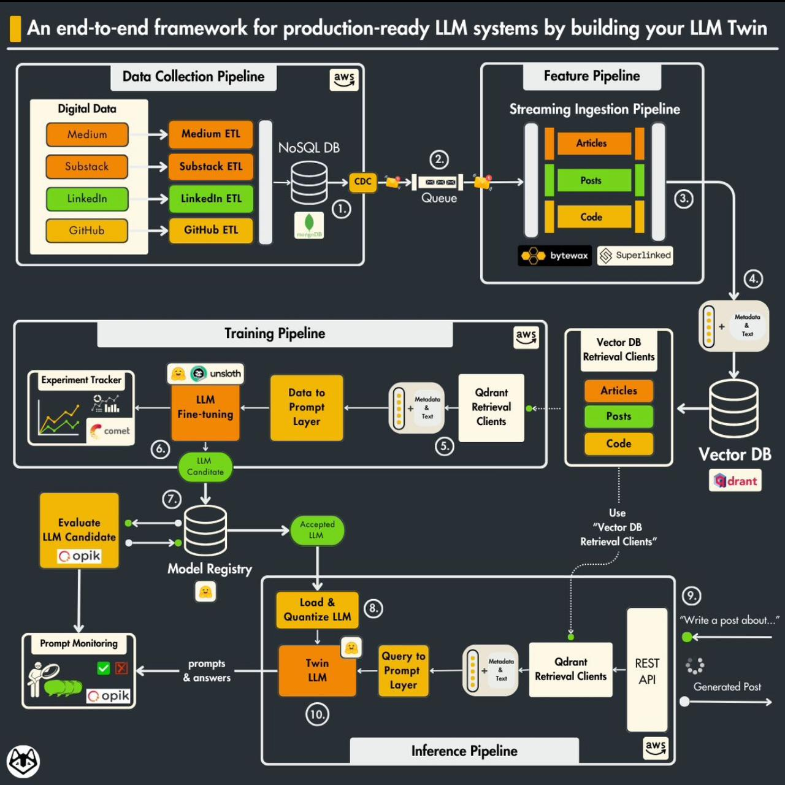

chapter-2 of the 𝗟𝗟𝗠 𝗘𝗻𝗴𝗶𝗻𝗲𝗲𝗿'𝘀 𝗛𝗮𝗻𝗱𝗯𝗼𝗼𝗸 📖  and it's all about 𝘁𝗼𝗼𝗹𝗶𝗻𝗴 𝗮𝗻𝗱 𝗶𝗻𝘀𝘁𝗮𝗹𝗹𝗮𝘁𝗶𝗼𝗻.

𝗸𝗲𝘆 𝗜𝗻𝘀𝗶𝗴𝗵𝘁𝘀 𝗳𝗿𝗼𝗺 𝗰𝗵𝗮𝗽𝘁𝗲𝗿 𝟮:

- 𝘀𝗲𝘁𝘁𝗶𝗻𝗴 𝘂𝗽 𝗱𝗲𝗽𝗲𝗻𝗱𝗲𝗻𝗰𝗶𝗲𝘀: installing essential tools like 𝗣𝘆𝘁𝗵𝗼𝗻 𝟯.𝟭𝟭, 𝗣𝗼𝗲𝘁𝗿𝘆, 𝗗𝗼𝗰𝗸𝗲𝗿, 𝗔𝗪𝗦 𝗖𝗟𝗜 and 𝗚𝗶𝘁.

- 𝗹𝗼𝗰𝗮𝗹 𝗲𝗻𝘃𝗶𝗿𝗼𝗻𝗺𝗲𝗻𝘁 𝘀𝗲𝘁𝘂𝗽:

  - using 𝗽𝘆𝗲𝗻𝘃 and 𝗽𝗼𝗲𝘁𝗿𝘆 to manage Python environments and dependencies.

  - configuring the `.env` file with credentials for 𝗢𝗽𝗲𝗻𝗔𝗜, 𝗛𝘂𝗴𝗴𝗶𝗻𝗴𝗙𝗮𝗰𝗲, 𝗖𝗼𝗺𝗲𝘁 𝗠𝗟, 𝗮𝗻𝗱 𝗢𝗽𝗶𝗸.

  - running local infrastructure with 𝗗𝗼𝗰𝗸𝗲𝗿 for 𝗠𝗼𝗻𝗴𝗼𝗗𝗕 and 𝗤𝗱𝗿𝗮𝗻𝘁.

  - starting the 𝗭𝗲𝗻𝗠𝗟 server for orchestration.

- 𝗰𝗹𝗼𝘂𝗱 𝘀𝗲𝗿𝘃𝗶𝗰𝗲𝘀 𝗶𝗻𝘁𝗲𝗴𝗿𝗮𝘁𝗶𝗼𝗻:

  - deploying models and pipelines to 𝗔𝗪𝗦 𝗦𝗮𝗴𝗲𝗠𝗮𝗸𝗲𝗿.

  - setting up 𝗖𝗼𝗺𝗲𝘁 𝗠𝗟 for experiment tracking and 𝗢𝗽𝗶𝗸 for prompt monitoring.

  - using 𝗚𝗶𝘁𝗛𝘂𝗯 𝗔𝗰𝘁𝗶𝗼𝗻𝘀 for CI/CD pipelines.

- 𝗽𝗿𝗼𝗷𝗲𝗰𝘁 𝘀𝘁𝗿𝘂𝗰𝘁𝘂𝗿𝗲 𝗼𝘃𝗲𝗿𝘃𝗶𝗲𝘄:

  - understanding core folders like `llm_engineering/`, `pipelines/`, `steps/`, and `tools/`.

  - scripts and utilities for running pipelines and inference services.

- 𝗿𝘂𝗻𝗻𝗶𝗻𝗴 𝗽𝗶𝗽𝗲𝗹𝗶𝗻𝗲𝘀 𝗮𝗻𝗱 𝘁𝗼𝗼𝗹𝘀:

  - data collection with web scraping tools like 𝗕𝗲𝗮𝘂𝘁𝗶𝗳𝘂𝗹𝗦𝗼𝘂𝗽 and 𝗦𝗰𝗿𝗮𝗽𝘆.

  - feature engineering and generating datasets for training.

  - training and evaluation pipelines using 𝗭𝗲𝗻𝗠𝗟.

  - deploying inference services and testing endpoints.

this chapter is a deep dive into setting up the backbone for building and deploying LLM applications.

stay tuned for chapter 3 next! 🚀

  

