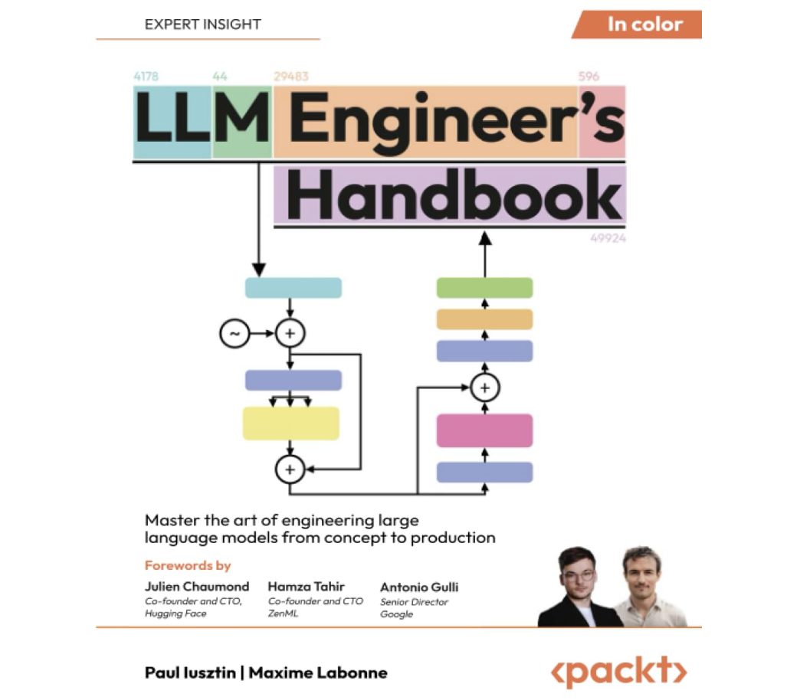

# The LLM Engineers Handbook

  

The **LLM Engineers Handbook** is a comprehensive guide for building production-level applications with large language models (LLMs). Using the LLM Twin project as an end-to-end example, this book covers the following chapters:

## Table of Contents

1. [Understanding LLM Architecture](#1-understanding-llm-architecture)
2. [Tooling and Installation](#2-tooling-and-installation)
3. [Data Engineering](#3-data-engineering)
4. [RAG Feature Pipeline](#4-rag-feature-pipeline)
5. [Supervised Fine-Tuning](#5-supervised-fine-tuning)
6. [Preference Alignment](#6-preference-alignment)
7. [Evaluating LLMs](#7-evaluating-llms)
8. [Inference Optimization](#8-inference-optimization)
9. [RAG Inference Pipeline](#9-rag-inference-pipeline)
10. [Inference Pipeline Deployment](#10-inference-pipeline-deployment)
11. [MLOps and LLMOps](#11-mlops-and-llmops)
12. [Appendix: MLOps Principles](#12-appendix-mlops-principles)

---

## 1. Understanding LLM Architecture

**Content**: Introduces the LLM Twin concept and the FTI (Features, Training, Inference) architecture for scalable ML systems.

**Talks about**:

- Architectural frameworks and design patterns specific to ML systems.

---

## 2. Tooling and Installation

**Content**: Presents essential tools for developing real-world LLM applications, including orchestrators, experiment trackers, prompt monitoring, and LLM evaluation tools.

**Tools Used**:

- **Python**: The primary programming language.
- **MLOps Tools**: 
    - * ZenML for Pipeline Orchestation
    - * CometML for experiment tracking
    - * Opik for Prompt Monitoring
    - * MongoDB to store unstructurd text data
    - * Qdrant vecore DB to store embeddings
    - * AWS CLI and Sagemaker - clound ML Lifecycle
    - * CI/CD - GitHub actions
---

## 3. Data Engineering

**Content**: Demonstrates how to collect and store raw data from dynamic sources like Medium, GitHub, and Linkedin Posts.

**Tools Used**:

- **Web Scraping Libraries**: BeautifulSoup, Scrapy.
- **APIs**: GitHub API, Medium API.
- **Data Warehouses**: Amazon S3, MongoDB.

---

## 4. RAG Feature Pipeline

**Content**: Explores Retrieval-Augmented Generation (RAG) concepts, embeddings, vector databases, and optimization techniques.

**Tools Used**:

- **Embedding Models**: SentenceTransformers.
- **Vector Databases**: Qdrant
- **RAG Frameworks**: Vanilla and Advanced RAG.

---

## 5. Supervised Fine-Tuning

**Content**: Covers refining pre-trained models using instruction-answer pairs and techniques like LoRA and QLoRA.

**Tools Used**:

- **Fine-Tuning Libraries**: Hugging Face Transformers.
- **LoRA/QLoRA Implementations**: PEFT library.
- **Models**: Llama 3.1 8B model.
- **Data Annotation Tools**: Label Studio.

---

## 6. Preference Alignment

**Content**: Introduces methods like Direct Preference Optimization (DPO) for aligning models with human preferences.

**Tools Used**:

- **Alignment Libraries**: Unsloth.
- **Preference Data Collection**: Custom annotation interfaces.
- **Models**: TwinLlama-3.1-8B.

---

## 7. Evaluating LLMs

**Content**: Details methods for assessing model performance using general-purpose and domain-specific benchmarks.

**Tools Used**:

- **Evaluation Frameworks**: OpenAI Evals, GLUE Benchmark.
- **Metrics Libraries**: BLEU, ROUGE, Perplexity.
- **Benchmark Suites**: HELM (Holistic Evaluation of Language Models).

---

## 8. Inference Optimization

**Content**: Discusses strategies like speculative decoding and weight quantization to improve inference speed and efficiency.

---

## 9. RAG Inference Pipeline

**Content**: Implements advanced RAG techniques and designs a custom retrieval module.

**Tools Used**:

- **Custom Retrieval Modules**: Built with Python and integrated with vector databases.
- **Frameworks**: Inspiration from LangChain.

---

## 10. Inference Pipeline Deployment

**Content**: Covers ML deployment strategies, deploying models to AWS SageMaker, and building RESTful APIs.

**Tools Used**:

- **AWS SageMaker**: For model hosting.
- **FastAPI**: To build RESTful APIs.
- **Docker**: For containerization.
- **API Gateways**: AWS API Gateway.

---

## 11. MLOps and LLMOps

**Content**: Explains deploying ML pipelines to the cloud, containerization with Docker, CI/CD/CT pipelines, and prompt monitoring.

**Tools Used**:

- **CI/CD Tools**: GitHub Actions.
- **Containerization**: Docker, AWS ECR.
- **Cloud Services**: AWS CloudFormation, Terraform.
- **Version Control**: Git.

---

## 12. Appendix: MLOps Principles

**Content**: Outlines principles for building scalable, reproducible, and robust ML applications.

**Tools Used**:

- General MLOps best practices and methodologies.

---

## Getting the Most Out of This Book

To maximize your learning experience, you should have:

- **Programming Skills**: Familiarity with Python.
- **Machine Learning Basics**: Understanding of basic ML and AI concepts.
- **Software Development Knowledge**: Comfortable with data structures, algorithms, and APIs.
- **Version Control**: Experience with Git.
- **Cloud Services**: Basic knowledge of AWS.

---

By integrating these tools into each chapter, the book provides a practical roadmap for engineers looking to build and deploy LLM applications effectively.

---

**Note**: This README provides a high-level overview of the book's contents and the tools you'll be working with. For detailed explanations and code examples, please refer to the individual chapters.

### Autors:
Maxime Labonne:
Paul Lusztin:

### Forewords by:
Julien Chamoud - Cofounder & CTO - HuggingFace
Hamza Tahir: Cofounder & CTO ZenML

